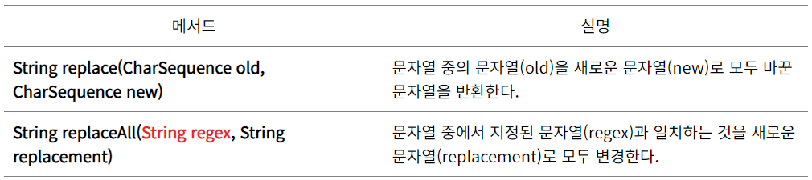

# 알아두면 좋은 함수들

## 🖊️문자

### 문자 대문자 소문자 확인
```
Character.isLowerCase(문자);
Character.isUpperCase(문자);
```

## 📮문자열

### 문자열 -> 문자 배열 변환
```
char[] ch = 문자열.toCharArray();
```

### 문자열을 역순으로 뒤집는 방법
```
1. new StringBuilder().append(문자열).reverse().toString();
2. new StringBuilder().append(정수[0]).append(정수[1])... .reverse().toString();
```

### 문자열 배열에서 원하는 문자열 찾기
```
1. Arrays.asList(문자열 배열).indexOf(타겟값)
```

### 문자열 대체 메소드 Replace/ReplaceAll
```
1. 문자열.replace(찾는 문자열,변환할 문자열);
2. 문자열.replaceAll(정규식,대체어)
```


## 🔢숫자

### 숫자 1234를 자릿수 별로 가져오는 방법 (chars()가 핵심)
```
String.valueOf(숫자).chars() 
```

### 가져온 후 각 자릿수 합을 구하는 방법
```
String.valueOf(숫자).chars().map(ch->ch-'0').sum();
```

### 정수 배열 중 특정 조건을 걸러 내는 방법
```
정수[] 변수 = Arrays.Stream(정수배열).filter(facotr->조건).toArray();
```

### !!! (GCD)최대 공약수 공식
```
public int gcd(int a, int b){
    if(b==0) return a;
    return gcd(b,a%b);
}
```

## 📐 수학 공식
```
n(2a+(n-1)d)/2                  // 등차수열 합
a(1-r^n)/(1-r)                  // 등비수열 합
최대 공약수 x 최대 공배수 = axb     // 최대 공약수, 최대 공배수 관계
```
